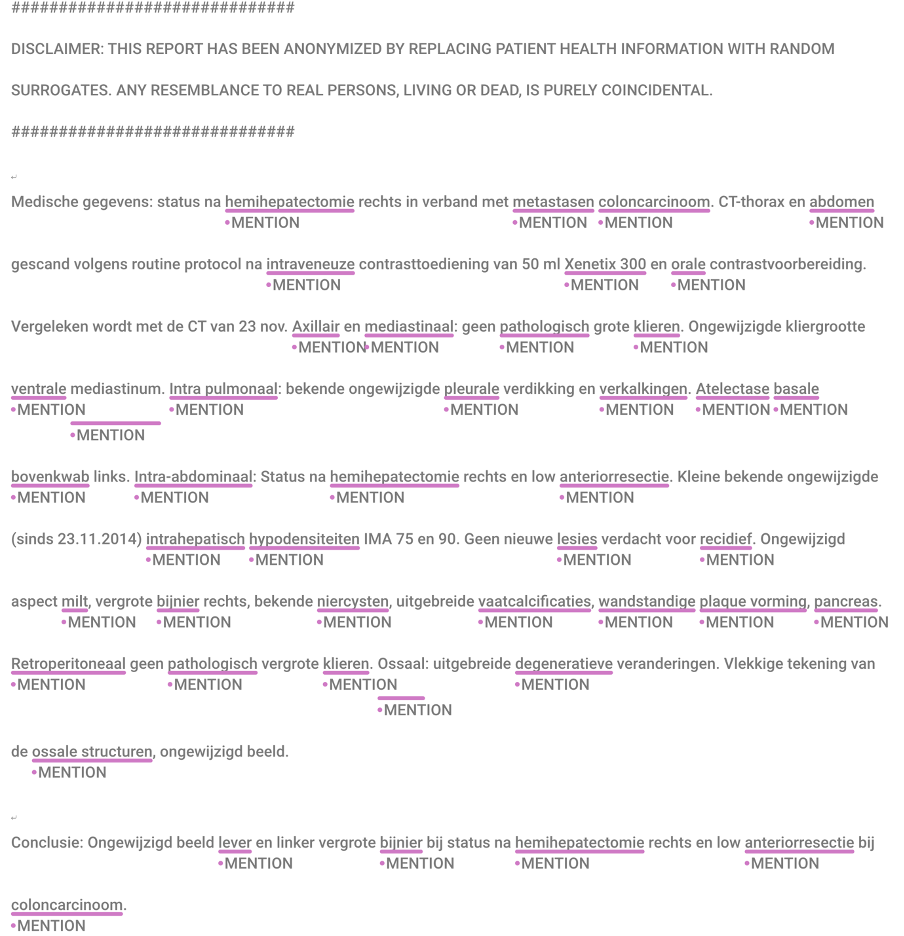

# Task 26: Medical terminology recognition
Visual:



Label tokenized: 
```
["O", "O", "O", "O", "O", "O", "O", "O", "O", "O", "O", "O", "O", "O", "O", "O", "O", "O", "O", "O", "O", "O", "O", "O", "O", "O", "O", "O", "O", "O", "O", "O", "O", "O", "O", "O", "O", "O", "O", "O", "O", "O", "O", "O", "O", "O", "O", "O", "O", "O", "O", "O", "O", "O", "O", "O", "O", "O", "O", "O", "O", "O", "O", "O", "O", "O", "O", "O", "O", "O", "O", "O", "O", "O", "O", "O", "O", "O", "O", "O", "O", "O", "O", "O", "O", "O", "O", "O", "O", "O", "O", "O", "O", "O", "O", "B-MENTION", "O", "O", "O", "O", "B-MENTION", "B-MENTION", "O", "O", "O", "O", "O", "B-MENTION", "O", "O", "O", "O", "O", "B-MENTION", "O", "O", "O", "O", "B-MENTION", "I-MENTION", "O", "B-MENTION", "O", "O", "O", "O", "O", "O", "O", "O", "O", "O", "O", "B-MENTION", "O", "B-MENTION", "O", "O", "B-MENTION", "O", "B-MENTION", "O", "O", "O", "B-MENTION", "B-MENTION", "O", "B-MENTION", "I-MENTION", "O", "O", "O", "B-MENTION", "O", "O", "B-MENTION", "O", "B-MENTION", "B-MENTION", "B-MENTION", "O", "O", "B-MENTION", "I-MENTION", "I-MENTION", "O", "O", "O", "B-MENTION", "O", "O", "O", "B-MENTION", "O", "O", "O", "O", "O", "O", "O", "O", "O", "O", "O", "O", "B-MENTION", "B-MENTION", "O", "O", "O", "O", "O", "O", "O", "B-MENTION", "O", "O", "B-MENTION", "O", "O", "O", "B-MENTION", "O", "O", "B-MENTION", "O", "O", "O", "B-MENTION", "O", "O", "B-MENTION", "O", "B-MENTION", "B-MENTION", "I-MENTION", "O", "B-MENTION", "O", "B-MENTION", "O", "B-MENTION", "O", "B-MENTION", "O", "B-MENTION", "O", "O", "B-MENTION", "O", "O", "O", "O", "O", "O", "B-MENTION", "I-MENTION", "O", "O", "O", "O", "O", "O", "O", "O", "B-MENTION", "O", "O", "O", "B-MENTION", "O", "O", "O", "B-MENTION", "O", "O", "O", "B-MENTION", "O", "B-MENTION", "O"]
```

Anonymous sample report (translated from Dutch using ChatGPT 4o with <a href="https://github.com/DIAGNijmegen/LLM_data_extractor/blob/2be30cb35ec58b7e3c9244411624538feecc93ca/data_extractor/prompt_templates/translation/system_prompt.txt" target="_blank">this prompt</a>):
```
##############################
DISCLAIMER: THIS REPORT HAS BEEN ANONYMIZED BY REPLACING PATIENT HEALTH INFORMATION WITH RANDOM SURROGATES. ANY RESEMBLANCE TO REAL PERSONS, LIVING OR DEAD, IS PURELY COINCIDENTAL.
##############################

Medical Data: Status post right hemihepatectomy due to colon carcinoma metastases. CT scan of the thorax and abdomen performed according to routine protocol following intravenous administration of 50 ml Xenetix 300 contrast and oral contrast preparation. Comparison made with the CT scan from November 23.

Axillary and Mediastinal: No pathologically enlarged lymph nodes. No change in lymph node size in the ventral mediastinum.

Intrapulmonary: Previously known pleural thickening and calcifications remain unchanged. Basal atelectasis of the left upper lobe.

Intra-abdominal: Status post right hemihepatectomy and low anterior resection. Small, previously known intrahepatic hypodensities (IMA 75 and 90) remain unchanged since 23.11.2014. No new lesions suspicious for recurrence. No change in the appearance of the spleen, enlarged right adrenal gland, known renal cysts, extensive vascular calcifications, mural plaque formation, or pancreas. No pathologically enlarged retroperitoneal lymph nodes.

Osseous: Extensive degenerative changes. Patchy appearance of osseous structures, unchanged from the previous scan.

Conclusion: No changes in the liver and the enlarged left adrenal gland in the context of status post right hemihepatectomy and low anterior resection for colon carcinoma.
```

Anonymous sample report tokenized:
```
["#", "#", "#", "#", "#", "#", "#", "#", "#", "#", "#", "#", "#", "#", "#", "#", "#", "#", "#", "#", "#", "#", "#", "#", "#", "#", "#", "#", "#", "#", "DISCLAIMER", ":", "THIS", "REPORT", "HAS", "BEEN", "ANONYMIZED", "BY", "REPLACING", "PATIENT", "HEALTH", "INFORMATION", "WITH", "RANDOM", "SURROGATES", ".", "ANY", "RESEMBLANCE", "TO", "REAL", "PERSONS", ",", "LIVING", "OR", "DEAD", ",", "IS", "PURELY", "COINCIDENTAL", ".", "#", "#", "#", "#", "#", "#", "#", "#", "#", "#", "#", "#", "#", "#", "#", "#", "#", "#", "#", "#", "#", "#", "#", "#", "#", "#", "#", "#", "#", "#", "Medische", "gegevens", ":", "status", "na", "hemihepatectomie", "rechts", "in", "verband", "met", "metastasen", "coloncarcinoom", ".", "CT", "-", "thorax", "en", "abdomen", "gescand", "volgens", "routine", "protocol", "na", "intraveneuze", "contrasttoediening", "van", "50", "ml", "Xenetix", "300", "en", "orale", "contrastvoorbereiding", ".", "Vergeleken", "wordt", "met", "de", "CT", "van", "23", "nov", ".", "Axillair", "en", "mediastinaal", ":", "geen", "pathologisch", "grote", "klieren", ".", "Ongewijzigde", "kliergrootte", "ventrale", "mediastinum", ".", "Intra", "pulmonaal", ":", "bekende", "ongewijzigde", "pleurale", "verdikking", "en", "verkalkingen", ".", "Atelectase", "basale", "bovenkwab", "links", ".", "Intra", "-", "abdominaal", ":", "Status", "na", "hemihepatectomie", "rechts", "en", "low", "anteriorresectie", ".", "Kleine", "bekende", "ongewijzigde", "(", "sinds", "23", ".", "11", ".", "2014", ")", "intrahepatisch", "hypodensiteiten", "IMA", "75", "en", "90", ".", "Geen", "nieuwe", "lesies", "verdacht", "voor", "recidief", ".", "Ongewijzigd", "aspect", "milt", ",", "vergrote", "bijnier", "rechts", ",", "bekende", "niercysten", ",", "uitgebreide", "vaatcalcificaties", ",", "wandstandige", "plaque", "vorming", ",", "pancreas", ".", "Retroperitoneaal", "geen", "pathologisch", "vergrote", "klieren", ".", "Ossaal", ":", "uitgebreide", "degeneratieve", "veranderingen", ".", "Vlekkige", "tekening", "van", "de", "ossale", "structuren", ",", "ongewijzigd", "beeld", ".", "Conclusie", ":", "Ongewijzigd", "beeld", "lever", "en", "linker", "vergrote", "bijnier", "bij", "status", "na", "hemihepatectomie", "rechts", "en", "low", "anteriorresectie", "bij", "coloncarcinoom", "."]
```
