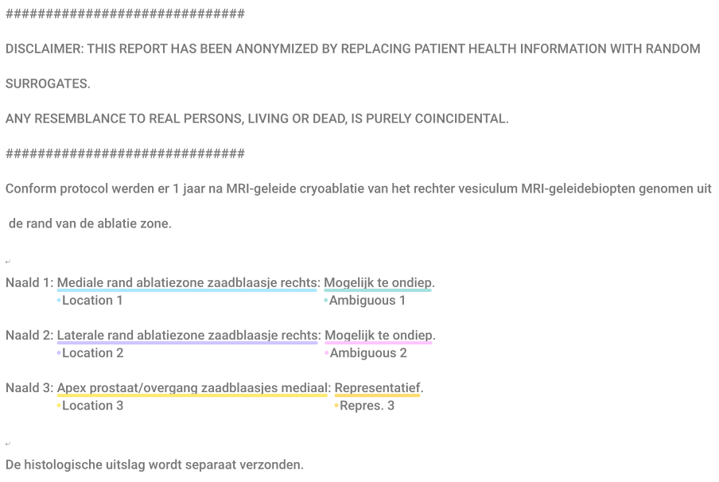

# Task 27: Prostate biopsy sampling
Visual:


Label tokenized: 
```
[ ["O"], ["O"], ["O"], ["O"], ["O"], ["O"], ["O"], ["O"], ["O"], ["O"], ["O"], ["O"], ["O"], ["O"], ["O"], ["O"], ["O"], ["O"], ["O"], ["O"], ["O"], ["O"], ["O"], ["O"], ["O"], ["O"], ["O"], ["O"], ["O"], ["O"], ["O"], ["O"], ["O"], ["O"], ["O"], ["O"], ["O"], ["O"], ["O"], ["O"], ["O"], ["O"], ["O"], ["O"], ["O"], ["O"], ["O"], ["O"], ["O"], ["O"], ["O"], ["O"], ["O"], ["O"], ["O"], ["O"], ["O"], ["O"], ["O"], ["O"], ["O"], ["O"], ["O"], ["O"], ["O"], ["O"], ["O"], ["O"], ["O"], ["O"], ["O"], ["O"], ["O"], ["O"], ["O"], ["O"], ["O"], ["O"], ["O"], ["O"], ["O"], ["O"], ["O"], ["O"], ["O"], ["O"], ["O"], ["O"], ["O"], ["O"], ["O"], ["O"], ["O"], ["O"], ["O"], ["O"], ["O"], ["O"], ["O"], ["O"], ["O"], ["O"], ["O"], ["O"], ["O"], ["O"], ["O"], ["O"], ["O"], ["O"], ["O"], ["O"], ["O"], ["O"], ["O"], ["O"], ["O"], ["O"], ["O"], ["O"], ["B-1-locatie naald"], ["I-1-locatie naald"], ["I-1-locatie naald"], ["I-1-locatie naald"], ["I-1-locatie naald"], ["O"], ["B-1-ambigu"], ["I-1-ambigu"], ["I-1-ambigu"], ["O"], ["O"], ["O"], ["O"], ["B-2-locatie naald"], ["I-2-locatie naald"], ["I-2-locatie naald"], ["I-2-locatie naald"], ["I-2-locatie naald"], ["O"], ["B-2-ambigu"], ["I-2-ambigu"], ["I-2-ambigu"], ["O"], ["O"], ["O"], ["O"], ["B-3-locatie naald"], ["I-3-locatie naald"], ["I-3-locatie naald"], ["I-3-locatie naald"], ["I-3-locatie naald"], ["I-3-locatie naald"], ["O"], ["B-3-representatief"], ["O"], ["O"], ["O"], ["O"], ["O"], ["O"], ["O"], ["O" ] ]
```

Anonymous sample report:
```
##############################
DISCLAIMER: THIS REPORT HAS BEEN ANONYMIZED BY REPLACING PATIENT HEALTH INFORMATION WITH RANDOM SURROGATES.
ANY RESEMBLANCE TO REAL PERSONS, LIVING OR DEAD, IS PURELY COINCIDENTAL.
##############################
Conform protocol werden er 1 jaar na MRI-geleide cryoablatie van het rechter vesiculum MRI-geleidebiopten genomen uit de rand van de ablatie zone.

Naald 1: Mediale rand ablatiezone zaadblaasje rechts: Mogelijk te ondiep. 
Naald 2: Laterale rand ablatiezone zaadblaasje rechts: Mogelijk te ondiep.
Naald 3: Apex prostaat/overgang zaadblaasjes mediaal: Representatief.

De histologische uitslag wordt separaat verzonden.
```

Anonymous sample report tokenized:
```
["#", "#", "#", "#", "#", "#", "#", "#", "#", "#", "#", "#", "#", "#", "#", "#", "#", "#", "#", "#", "#", "#", "#", "#", "#", "#", "#", "#", "#", "#", "DISCLAIMER", ":", "THIS", "REPORT", "HAS", "BEEN", "ANONYMIZED", "BY", "REPLACING", "PATIENT", "HEALTH", "INFORMATION", "WITH", "RANDOM", "SURROGATES", ".", "ANY", "RESEMBLANCE", "TO", "REAL", "PERSONS", ",", "LIVING", "OR", "DEAD", ",", "IS", "PURELY", "COINCIDENTAL", ".", "#", "#", "#", "#", "#", "#", "#", "#", "#", "#", "#", "#", "#", "#", "#", "#", "#", "#", "#", "#", "#", "#", "#", "#", "#", "#", "#", "#", "#", "#", "Conform", "protocol", "werden", "er", "1", "jaar", "na", "MRI", "-", "geleide", "cryoablatie", "van", "het", "rechter", "vesiculum", "MRI", "-", "geleidebiopten", "genomen", "uit", "de", "rand", "van", "de", "ablatie", "zone", ".", "Naald", "1", ":", "Mediale", "rand", "ablatiezone", "zaadblaasje", "rechts", ":", "Mogelijk", "te", "ondiep", ".", "Naald", "2", ":", "Laterale", "rand", "ablatiezone", "zaadblaasje", "rechts", ":", "Mogelijk", "te", "ondiep", ".", "Naald", "3", ":", "Apex", "prostaat", "\/", "overgang", "zaadblaasjes", "mediaal", ":", "Representatief", ".", "De", "histologische", "uitslag", "wordt", "separaat", "verzonden", "."]
```
