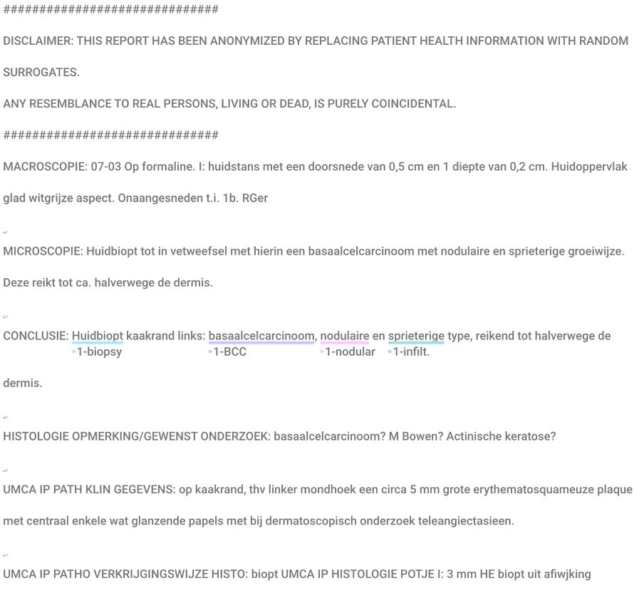

# Task 28: Skin histopathology diagnosis
Visual:



Label tokenized: 
```
[ ["O"], ["O"], ["O"], ["O"], ["O"], ["O"], ["O"], ["O"], ["O"], ["O"], ["O"], ["O"], ["O"], ["O"], ["O"], ["O"], ["O"], ["O"], ["O"], ["O"], ["O"], ["O"], ["O"], ["O"], ["O"], ["O"], ["O"], ["O"], ["O"], ["O"], ["O"], ["O"], ["O"], ["O"], ["O"], ["O"], ["O"], ["O"], ["O"], ["O"], ["O"], ["O"], ["O"], ["O"], ["O"], ["O"], ["O"], ["O"], ["O"], ["O"], ["O"], ["O"], ["O"], ["O"], ["O"], ["O"], ["O"], ["O"], ["O"], ["O"], ["O"], ["O"], ["O"], ["O"], ["O"], ["O"], ["O"], ["O"], ["O"], ["O"], ["O"], ["O"], ["O"], ["O"], ["O"], ["O"], ["O"], ["O"], ["O"], ["O"], ["O"], ["O"], ["O"], ["O"], ["O"], ["O"], ["O"], ["O"], ["O"], ["O"], ["O"], ["O"], ["O"], ["O"], ["O"], ["O"], ["O"], ["O"], ["O"], ["O"], ["O"], ["O"], ["O"], ["O"], ["O"], ["O"], ["O"], ["O"], ["O"], ["O"], ["O"], ["O"], ["O"], ["O"], ["O"], ["O"], ["O"], ["O"], ["O"], ["O"], ["O"], ["O"], ["O"], ["O"], ["O"], ["O"], ["O"], ["O"], ["O"], ["O"], ["O"], ["O"], ["O"], ["O"], ["O"], ["O"], ["O"], ["O"], ["O"], ["O"], ["O"], ["O"], ["O"], ["O"], ["O"], ["O"], ["O"], ["O"], ["O"], ["O"], ["O"], ["O"], ["O"], ["O"], ["O"], ["O"], ["O"], ["O"], ["O"], ["B-1-biopt"], ["O"], ["O"], ["O"], ["B-1-BCC"], ["O"], ["B-1-nodular"], ["O"], ["B-1-infiltrative"], ["O"], ["O"], ["O"], ["O"], ["O"], ["O"], ["O"], ["O"], ["O"], ["O"], ["O"], ["O"], ["O"], ["O"], ["O"], ["O"], ["O"], ["O"], ["O"], ["O"], ["O"], ["O"], ["O"], ["O"], ["O"], ["O"], ["O"], ["O"], ["O"], ["O"], ["O"], ["O"], ["O"], ["O"], ["O"], ["O"], ["O"], ["O"], ["O"], ["O"], ["O"], ["O"], ["O"], ["O"], ["O"], ["O"], ["O"], ["O"], ["O"], ["O"], ["O"], ["O"], ["O"], ["O"], ["O"], ["O"], ["O"], ["O"], ["O"], ["O"], ["O"], ["O"], ["O"], ["O"], ["O"], ["O"], ["O"], ["O"], ["O"], ["O"], ["O"], ["O"] ]
```

Anonymous sample report:
```
##############################
DISCLAIMER: THIS REPORT HAS BEEN ANONYMIZED BY REPLACING PATIENT HEALTH INFORMATION WITH RANDOM SURROGATES.
ANY RESEMBLANCE TO REAL PERSONS, LIVING OR DEAD, IS PURELY COINCIDENTAL.
##############################
MACROSCOPIE: 07-03 Op formaline. I: huidstans met een doorsnede van 0,5 cm en 1 diepte van 0,2 cm. Huidoppervlak glad witgrijze aspect. Onaangesneden t.i. 1b. RGer

MICROSCOPIE: Huidbiopt tot in vetweefsel met hierin een basaalcelcarcinoom met nodulaire en sprieterige groeiwijze. Deze reikt tot ca. halverwege de dermis.

CONCLUSIE: Huidbiopt kaakrand links: basaalcelcarcinoom, nodulaire en sprieterige type, reikend tot halverwege de dermis.

HISTOLOGIE OPMERKING/GEWENST ONDERZOEK: basaalcelcarcinoom? M Bowen? Actinische keratose?

UMCA IP PATH KLIN GEGEVENS: op kaakrand, thv linker mondhoek een circa 5 mm grote erythematosquameuze plaque met centraal enkele wat glanzende papels met bij dermatoscopisch onderzoek teleangiectasieen.

UMCA IP PATHO VERKRIJGINGSWIJZE HISTO: biopt UMCA IP HISTOLOGIE POTJE I: 3 mm HE biopt uit afiwjking
```

Anonymous sample report tokenized:
```
["#", "#", "#", "#", "#", "#", "#", "#", "#", "#", "#", "#", "#", "#", "#", "#", "#", "#", "#", "#", "#", "#", "#", "#", "#", "#", "#", "#", "#", "#", "DISCLAIMER", ":", "THIS", "REPORT", "HAS", "BEEN", "ANONYMIZED", "BY", "REPLACING", "PATIENT", "HEALTH", "INFORMATION", "WITH", "RANDOM", "SURROGATES", ".", "ANY", "RESEMBLANCE", "TO", "REAL", "PERSONS", ",", "LIVING", "OR", "DEAD", ",", "IS", "PURELY", "COINCIDENTAL", ".", "#", "#", "#", "#", "#", "#", "#", "#", "#", "#", "#", "#", "#", "#", "#", "#", "#", "#", "#", "#", "#", "#", "#", "#", "#", "#", "#", "#", "#", "#", "MACROSCOPIE", ":", "07", "-", "03", "Op", "formaline", ".", "I", ":", "huidstans", "met", "een", "doorsnede", "van", "0", ",", "5", "cm", "en", "1", "diepte", "van", "0", ",", "2", "cm", ".", "Huidoppervlak", "glad", "witgrijze", "aspect", ".", "Onaangesneden", "t", ".", "i", ".", "1", "b", ".", "RGer", "MICROSCOPIE", ":", "Huidbiopt", "tot", "in", "vetweefsel", "met", "hierin", "een", "basaalcelcarcinoom", "met", "nodulaire", "en", "sprieterige", "groeiwijze", ".", "Deze", "reikt", "tot", "ca", ".", "halverwege", "de", "dermis", ".", "CONCLUSIE", ":", "Huidbiopt", "kaakrand", "links", ":", "basaalcelcarcinoom", ",", "nodulaire", "en", "sprieterige", "type", ",", "reikend", "tot", "halverwege", "de", "dermis", ".", "HISTOLOGIE", "OPMERKING", "\/", "GEWENST", "ONDERZOEK", ":", "basaalcelcarcinoom", "?", "M", "Bowen", "?", "Actinische", "keratose", "?", "UMCA", "IP", "PATH", "KLIN", "GEGEVENS", ":", "op", "kaakrand", ",", "thv", "linker", "mondhoek", "een", "circa", "5", "mm", "grote", "erythematosquameuze", "plaque", "met", "centraal", "enkele", "wat", "glanzende", "papels", "met", "bij", "dermatoscopisch", "onderzoek", "teleangiectasieen", ".", "UMCA", "IP", "PATHO", "VERKRIJGINGSWIJZE", "HISTO", ":", "biopt", "UMCA", "IP", "HISTOLOGIE", "POTJE", "I", ":", "3", "mm", "HE", "biopt", "uit", "afiwjking"]
```